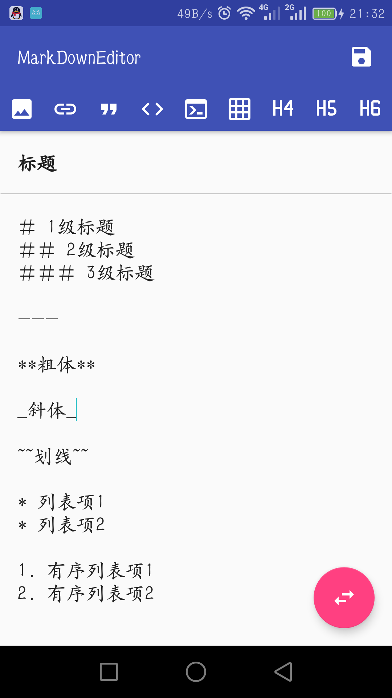
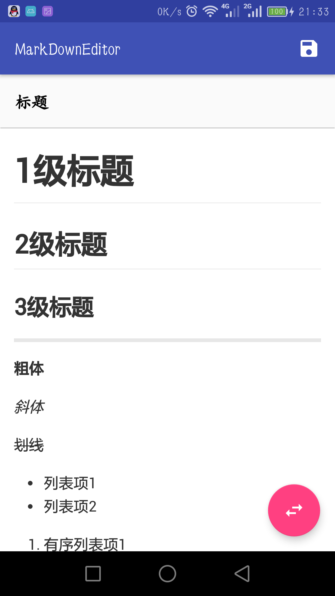

# MarkDownEditor
Android MarkDown Editor Library. 
安卓 MarkDown 编辑及解析库

## 文件目录说明
* app文件夹下为demo
* markdown文件夹下为library，可作为module导入
  * 建议使用 MarkDownController 进行统一逻辑控制
  * 亦可自行控制 MarkDownEditorView 与 MarkDownPreviewView 的交互

## 使用及参考的开源库
* [butterknife](https://github.com/JakeWharton/butterknife)
* [marked](https://github.com/chjj/marked)
* [MarkdownEditors](https://github.com/qinci/MarkdownEditors)  
  * 本项目的 MarkDown 解析部分以及图片资源大多参考自 [MarkdownEditors](https://github.com/qinci/MarkdownEditors)，在此提出郑重感谢。
  
## Demo效果
* 编辑 
  
  
  
  
